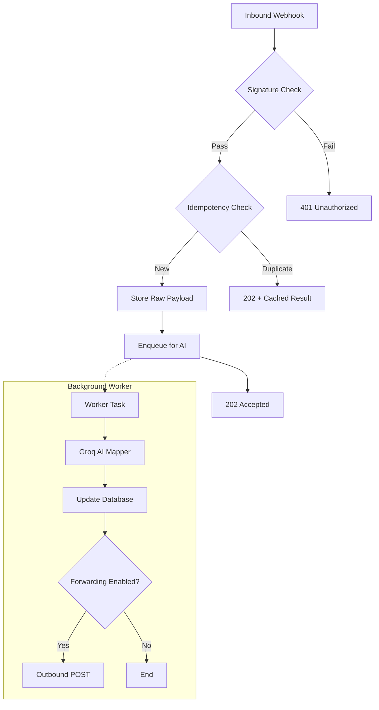

# ⚡ Universal Webhook Adapter v2

[](https://opensource.org/licenses/MIT)
[](https://fastapi.tiangolo.com/)
[](https://reactjs.org/)
[](https://groq.com/)

Accepts **any** JSON webhook, verifies its signature, deduplicates it, and normalises the payload into a standard schema via **Groq AI (Llama 3)** — all in a production-ready FastAPI service with a beautiful React dashboard for real-time monitoring.

---

## ✨ Key Features

| Feature | Detail |
|---|---|
| **AI Normalization** | Uses **Groq (Llama-3.3-70b)** to intelligently map diverse JSON schemas into a standard internal format. |
| **Signature Verification** | HMAC-SHA256 support for **Stripe** (`Stripe-Signature`) and **GitHub** (`X-Hub-Signature-256`). |
| **Background Processing** | Multi-stage queue with `asyncio`. Returns `202 Accepted` immediately; processing happens asynchronously. |
| **Outbound Delivery** | Automatically forwards normalized payloads to a target URL with configurable retries. |
| **Idempotency** | Prevents duplicate processing via intelligent key resolution (Headers, Payload IDs, or Hashing). |
| **Simulation Hub** | Built-in tools in the dashboard to simulate Stripe/GitHub webhooks for easy testing. |
| **Real-time Dashboard** | Shimmering React UI to monitor logs, replay webhooks, and view system health. |

---

## 🏗️ Architecture



---

## 📂 Project Structure

```text
.
├── app/                  # Backend (FastAPI)
│   ├── api/              # API Routes (Webhook, Dashboard, System)
│   ├── core/             # Configuration, Security, Rate Limiting
│   ├── db/               # Database Models and Session management
│   ├── services/         # Business Logic (AI Mapping, Queue, Idempotency)
│   └── main.py           # Application Entrypoint
├── frontend/             # Dashboard (React + Vite + Tailwind)
│   ├── src/              # Components, Hooks, API services
│   └── ...
├── .env.example          # Environment Template
└── requirements.txt      # Python Dependencies
```

---

## 🚀 Quick Start

### 1. Backend Setup
```bash
# Clone the repository
git clone https://github.com/Cheezu-hub/universal-webhooks.git
cd universal-webhooks

# Install dependencies
pip install -r requirements.txt

# Configure environment
cp .env.example .env
# Required: GROQ_API_KEY
# Optional: STRIPE_WEBHOOK_SECRET, GITHUB_WEBHOOK_SECRET, OUTBOUND_TARGET_URL

# Run the server
uvicorn app.main:app --reload
```
Interactive docs: [http://localhost:8000/docs](http://localhost:8000/docs)

### 2. Frontend Setup
```bash
cd frontend
npm install
npm run dev
```
Dashboard: [http://localhost:5173](http://localhost:5173)

---

## ⚙️ Configuration Reference

| Variable | Default | Description |
|---|---|---|
| `AI_PROVIDER` | `groq` | AI engine to use |
| `GROQ_API_KEY` | *(required)* | Your Groq API key |
| `STRIPE_WEBHOOK_SECRET` | `""` | Stripe signing secret (`whsec_…`) |
| `GITHUB_WEBHOOK_SECRET` | `""` | GitHub webhook secret |
| `OUTBOUND_TARGET_URL` | `""` | Where to POST normalized payloads |
| `RATE_LIMIT` | `100/minute` | Per-IP limit |

---

## 📜 License

Distributed under the MIT License. See `LICENSE` for more information.
