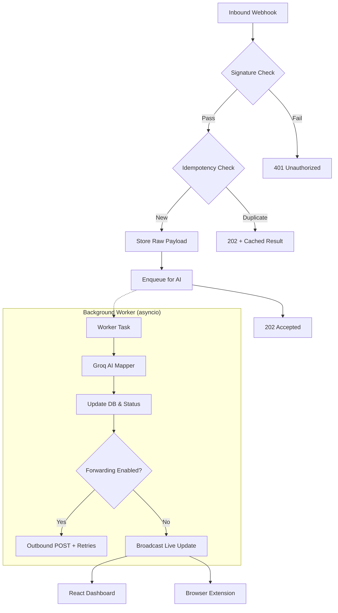

# ⚡ Universal Webhook Adapter v2

<div align="center">
  
  <p align="center">
    <strong>A high-performance middleware for intelligent webhook normalization and real-time monitoring.</strong>
  </p>

  <p align="center">
    <a href="https://universal-webhooks.vercel.app"><strong>🌐 Live Demo</strong></a> • 
    <a href="https://universal-webhooks.onrender.com/docs"><strong>📖 API Docs</strong></a>
  </p>

  [](https://opensource.org/licenses/MIT)
  [](https://fastapi.tiangolo.com/)
  [](https://reactjs.org/)
  [](https://groq.com/)
  [](https://tailwindcss.com/)
</div>

---

## 📖 Overview

**Universal Webhook Adapter** is a production-ready middleware designed to bridge the gap between diverse webhook sources and your application's internal data requirements. 

It accepts JSON payloads from any source (Stripe, GitHub, Shopify, etc.), verifies signatures for security, deduplicates requests for reliability, and uses **Groq-powered AI (Llama 3.3)** to intelligently normalize data into a consistent internal schema.

### Why use this?
- **Schema Agnostic**: Stop writing custom parsers for every new integration.
- **AI-Powered**: Let LLMs handle the complex mapping and entity extraction.
- **Real-time Observability**: Monitor every step of the lifecycle through a sleek React dashboard.
- **Resilient**: Built-in retries, background queues, and signature verification.

---

## ✨ Key Features

| Feature | Description |
|---|---|
| **🧠 AI Normalization** | Uses **Groq (Llama-3.3-70b)** to intelligently map diverse JSON schemas into a unified internal format with high confidence. |
| **🛡️ Signature Verification** | Built-in HMAC-SHA256 support for **Stripe** (`Stripe-Signature`), **GitHub** (`X-Hub-Signature-256`), and **Shopify**. |
| **⚡ Background Processing** | Multi-stage queue powered by `asyncio`. Returns `202 Accepted` immediately; processing happens asynchronously. |
| **🧩 Browser Extension** | A dedicated Chrome/Edge extension to monitor webhooks directly from your browser. |
| **🔄 Outbound Delivery** | Automatically forwards normalized payloads to your target URL with exponential backoff retries. |
| **🆔 Idempotency** | Prevents duplicate processing via intelligent key resolution (Headers, Payload IDs, or Content Hashing). |
| **📊 Real-time Dashboard** | Sleek React UI with live updates (SSE), metrics, replay capabilities, and log inspection. |

---

## 🏗️ Architecture

The system follows a reactive, event-driven architecture designed for high throughput and low latency.


```mermaid
graph TD
    A[Inbound Webhook] --> B{Signature Check}
    B -- Pass --> C{Idempotency Check}
    B -- Fail --> D[401 Unauthorized]
    C -- New --> E[Store Raw Payload]
    C -- Duplicate --> F[202 + Cached Result]
    E --> G[Enqueue for AI]
    G --> H[202 Accepted]
    
    subgraph "Background Worker (asyncio)"
        I[Worker Task] --> J[Groq AI Mapper]
        J --> K[Update DB & Status]
        K --> L{Forwarding Enabled?}
        L -- Yes --> M[Outbound POST + Retries]
        L -- No --> N[Broadcast Live Update]
    end
    
    G -.-> I
    N --> O[React Dashboard]
    N --> P[Browser Extension]
```

---

## 🛠️ Tech Stack

- **Backend**: Python 3.10+, FastAPI, SQLAlchemy, SQLite, Pydantic.
- **Frontend**: React 18, Vite, Tailwind CSS, Framer Motion, Lucide Icons.
- **AI**: Groq SDK (Llama 3.3 70B).
- **Extension**: Manifest v3, Vanilla JS/CSS.
- **DevOps**: Docker ready, Unified Dev Script.

---

## 🚀 Getting Started

### Prerequisites
- Python 3.10+
- Node.js 18+
- [Groq API Key](https://console.groq.com/)

### ⚡ The Fast Way (Unified Dev Server)
Run both backend and frontend with a single command:
```bash
python scripts/dev.py
```
*This script automatically checks ports, creates your `.env` if missing, and merges logs into one terminal.*

---

## 🔧 Manual Setup

### 1. Backend Setup
```bash
# Install dependencies
pip install -r requirements.txt

# Configure environment
cp .env.example .env
# Edit .env and add your GROQ_API_KEY

# Run the server
uvicorn app.main:app --reload
```
- **Base URL:** [http://localhost:8000](http://localhost:8000)
- **Health Check:** [http://localhost:8000/health](http://localhost:8000/health)

### 2. Frontend Setup
```bash
cd frontend
npm install
npm run dev
```
- **Dashboard:** [http://localhost:5173](http://localhost:5173)

### 3. Extension Setup
1. Open Chrome/Edge and navigate to `chrome://extensions`.
2. Enable **Developer mode** (top right).
3. Click **Load unpacked** and select the `extension` folder in this repository.

---

## 🌐 Production Endpoints

| Resource | URL |
|---|---|
| **Live Dashboard** | [https://universal-webhooks.vercel.app](https://universal-webhooks.vercel.app) |
| **Production API** | [https://universal-webhooks.onrender.com](https://universal-webhooks.onrender.com) |
| **API Documentation** | [https://universal-webhooks.onrender.com/docs](https://universal-webhooks.onrender.com/docs) |

---

## 📂 Project Structure

```text
.
├── app/                  # Backend (FastAPI)
│   ├── api/              # API Routes (Webhook, Simulation, Dashboard)
│   ├── core/             # Configuration, Security (HMAC), Rate Limiting
│   ├── db/               # Database Models (SQLAlchemy + SQLite)
│   ├── services/         # Business Logic (AI Mapping, Queue, Broadcaster)
│   ├── utils/            # Shared utilities (Logging, Helpers)
│   └── main.py           # Application Entrypoint
├── frontend/             # Dashboard (React + Vite + Tailwind)
│   ├── src/              # Components, Pages, SSE Hooks
│   └── ...
├── extension/            # Browser Extension (Manifest v3)
│   ├── manifest.json     # Extension Configuration
│   ├── background.js     # Background listener for SSE/Notifications
│   └── popup.js          # Extension UI Logic
├── scripts/              # Dev & Build Scripts
│   └── dev.py            # Unified Development Server
├── .env.example          # Environment Template
└── requirements.txt      # Python Dependencies
```

---

## ⚙️ Configuration Reference

| Variable | Default | Description |
|---|---|---|
| `GROQ_API_KEY` | *(required)* | Your Groq API key for AI mapping |
| `OUTBOUND_TARGET_URL` | `""` | Where to POST normalized payloads |
| `AI_PROVIDER` | `groq` | AI Provider (currently only Groq supported) |
| `GROQ_MODEL` | `llama-3.3-70b-versatile` | Model to use for normalization |
| `STRIPE_WEBHOOK_SECRET` | `""` | Stripe signing secret (`whsec_…`) |
| `GITHUB_WEBHOOK_SECRET` | `""` | GitHub webhook secret |
| `RATE_LIMIT` | `100/minute` | Per-IP limit for the universal endpoint |

---

## 🔌 API Endpoints

### Core Webhook
- `POST /universal-webhook`: Send any JSON here for normalization.
- `GET /webhooks/{request_id}`: Poll for status and normalized data.
- `POST /api/webhooks/{request_id}/replay`: Re-trigger AI mapping and delivery.

### Simulation & Live Data
- `POST /api/webhooks/simulate`: Trigger mock events (Stripe, GitHub, Shopify).
- `POST /api/v1/simulate`: Send custom JSON payloads for AI testing.
- `GET /api/events/stream`: Server-Sent Events (SSE) stream for real-time updates.
- `GET /api/webhooks`: Fetch recent webhook history.
- `GET /api/system/status`: Get real-time system metrics.

---

## 🖼️ Visuals

<details>
<summary>View Dashboard Preview</summary>

*Add your screenshots here!*

</details>

<details>
<summary>View Extension Preview</summary>

*Add your screenshots here!*

</details>

---

## 📜 License
Distributed under the MIT License. See `LICENSE` for more information.

Developed with ❤️ by the **Cheezu Hub** team.

