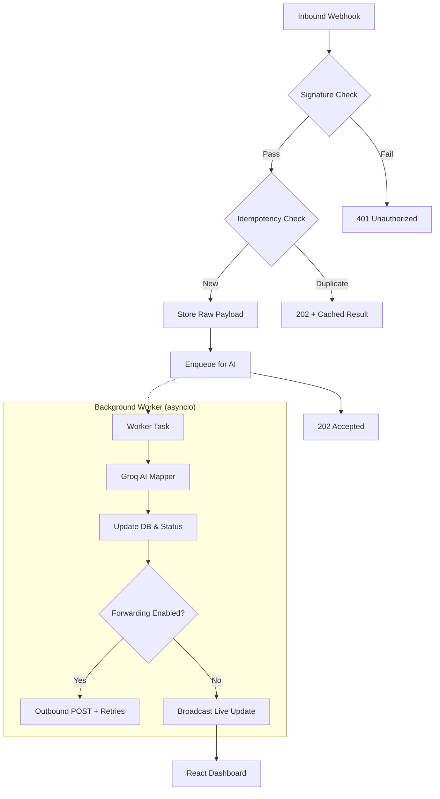

# ⚡ Universal Webhook Adapter v2

[](https://opensource.org/licenses/MIT)
[](https://fastapi.tiangolo.com/)
[](https://reactjs.org/)
[](https://groq.com/)
[](https://tailwindcss.com/)

**Universal Webhook Adapter** is a production-ready middleware that accepts any JSON webhook, verifies its signature, deduplicates it, and intelligently normalizes the payload into a standard schema using **Groq AI (Llama 3)**. It features a high-performance FastAPI backend and a shimmering React dashboard for real-time monitoring and simulation.

---

## ✨ Key Features

| Feature | Detail |
|---|---|
| **🧠 AI Normalization** | Uses **Groq (Llama-3.3-70b)** to intelligently map diverse JSON schemas into a unified internal format with high confidence. |
| **🛡️ Signature Verification** | Built-in HMAC-SHA256 support for **Stripe** (`Stripe-Signature`), **GitHub** (`X-Hub-Signature-256`), and **Shopify**. |
| **⚡ Background Processing** | Multi-stage queue powered by `asyncio`. Returns `202 Accepted` immediately; processing happens asynchronously. |
| **🔄 Outbound Delivery** | Automatically forwards normalized payloads to your target URL with exponential backoff retries (via `tenacity`). |
| **🆔 Idempotency** | Prevents duplicate processing via intelligent key resolution (Headers, Payload IDs, or Content Hashing). |
| **🧪 Simulation Hub** | Built-in tools to simulate Stripe, GitHub, and Shopify webhooks, or send custom JSON for instant testing. |
| **📊 Real-time Dashboard** | Sleek React UI with live updates (Server-Sent Events), metrics, replay capabilities, and log inspection. |

---

## 🏗️ Architecture & Flow


```mermaid
graph TD
    A[Inbound Webhook] --> B{Signature Check}
    B -- Pass --> C{Idempotency Check}
    B -- Fail --> D[401 Unauthorized]
    C -- New --> E[Store Raw Payload]
    C -- Duplicate --> F[202 + Cached Result]
    E --> G[Enqueue for AI]
    G --> H[202 Accepted]
    
    subgraph "Background Worker (asyncio)"
        I[Worker Task] --> J[Groq AI Mapper]
        J --> K[Update DB & Status]
        K --> L{Forwarding Enabled?}
        L -- Yes --> M[Outbound POST + Retries]
        L -- No --> N[Broadcast Live Update]
    end
    
    G -.-> I
    N --> O[React Dashboard]
```

---

## 📂 Project Structure

```text
.
├── app/                  # Backend (FastAPI)
│   ├── api/              # API Routes (Webhook, Simulation, Dashboard)
│   ├── core/             # Configuration, Security (HMAC), Rate Limiting
│   ├── db/               # Database Models (SQLAlchemy + SQLite)
│   ├── services/         # Business Logic (AI Mapping, Queue, Broadcaster)
│   ├── utils/            # Shared utilities (Logging, Helpers)
│   └── main.py           # Application Entrypoint
├── frontend/             # Dashboard (React + Vite + Tailwind)
│   ├── src/              # Components, Pages, SSE Hooks
│   └── ...
├── scripts/              # Dev & Build Scripts
│   └── dev.py            # Unified Development Server
├── .env.example          # Environment Template
└── requirements.txt      # Python Dependencies
```

---

## 🚀 Getting Started

### Prerequisites
- Python 3.10+
- Node.js 18+
- [Groq API Key](https://console.groq.com/)

### ⚡ The Fast Way (Unified Dev Server)
Run both backend and frontend with a single command:
```bash
python scripts/dev.py
```
*This script automatically checks ports, creates your `.env` if missing, and merges logs into one terminal.*

---

### 🛠️ Manual Setup

#### 1. Backend Setup
```bash
# Install dependencies
pip install -r requirements.txt

# Configure environment
cp .env.example .env
# Edit .env and add your GROQ_API_KEY

# Run the server
uvicorn app.main:app --reload
```
- **API Docs:** [http://localhost:8000/docs](http://localhost:8000/docs) (Note: Custom dashboard is served at root)

#### 2. Frontend Setup
```bash
cd frontend
npm install
npm run dev
```
- **Dashboard:** [http://localhost:5173](http://localhost:5173)

---

## ⚙️ Configuration Reference (`.env`)

| Variable | Default | Description |
|---|---|---|
| `GROQ_API_KEY` | *(required)* | Your Groq API key for AI mapping |
| `OUTBOUND_TARGET_URL` | `""` | Where to POST normalized payloads |
| `LOG_LEVEL` | `INFO` | Logging verbosity (DEBUG, INFO, WARNING, ERROR) |
| `STRIPE_WEBHOOK_SECRET` | `""` | Stripe signing secret (`whsec_…`) |
| `GITHUB_WEBHOOK_SECRET` | `""` | GitHub webhook secret for HMAC verification |
| `RATE_LIMIT` | `100/minute` | Per-IP limit for the universal endpoint |

---

## 🔌 API Endpoints

### Webhook Management
- `POST /universal-webhook`: Send any JSON here.
- `GET /webhooks/{request_id}`: Poll for status and normalized data.
- `POST /api/webhooks/{request_id}/replay`: Re-run the AI mapping and delivery.

### Simulation & Live Data
- `POST /api/webhooks/simulate`: Trigger mock events (Stripe, GitHub, Shopify).
- `POST /api/v1/simulate`: Send custom JSON payloads for AI testing.
- `GET /api/events/stream`: SSE stream for real-time dashboard updates.

---

## 🧠 How the AI Normalization Works
The system uses a sophisticated prompt engineering strategy to map unknown JSON structures to a standard schema. It doesn't just guess; it:
1. Analyzes the source fields and values.
2. Identifies the "Event Type" (e.g., `payment.succeeded`, `repo.push`).
3. Extracts key entities (user, amount, timestamp).
4. Assigns a **confidence score** to the mapping.
5. Returns a structured JSON that follows your internal domain model.

---

## 📜 License
Distributed under the MIT License. See `LICENSE` for more information.

Developed with ❤️ by the **Cheezu Hub** team.
